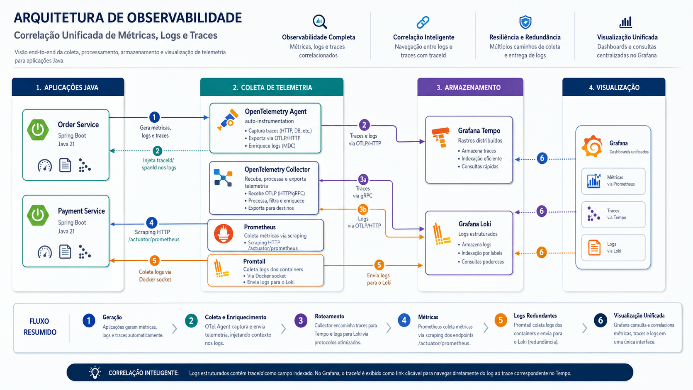
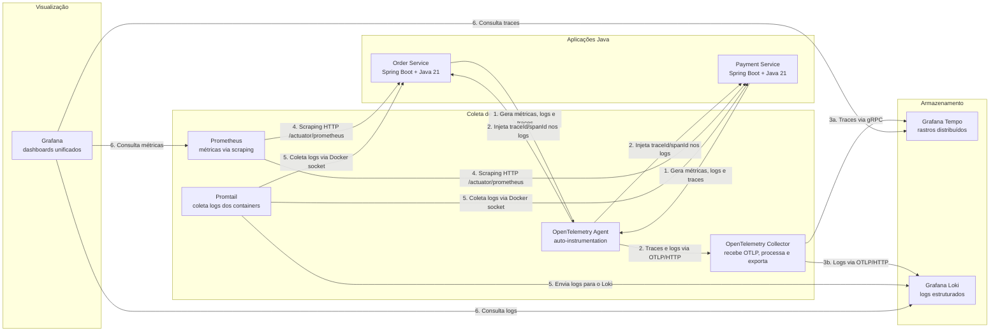

# 🔭 Observabilidade com OpenTelemetry e Grafana Stack

**Um case prático de observabilidade em microsserviços Java com Spring Boot, OpenTelemetry, Prometheus, Loki, Tempo e Grafana.**

[](LICENSE)
[](https://openjdk.org/projects/jdk/21/)
[](https://spring.io/projects/spring-boot)
[](https://opentelemetry.io/)
[](https://grafana.com/)

---

## 📖 Sobre o Projeto

Este repositório implementa uma plataforma completa de **observabilidade e monitoramento** para dois microsserviços Java (Order Service e Payment Service), utilizando tecnologias open source líderes no mercado. O objetivo é demonstrar na prática os três pilares da observabilidade — **métricas, logs e rastreamento distribuído** —, integrados em dashboards unificados no Grafana.

O projeto foi desenvolvido como material complementar ao curso [Observabilidade e Monitoramento em Ambientes Distribuídos](https://www.alura.com.br/conteudo/observabilidade-e-monitoramento-em-ambientes-distribuidos) da Alura, mas é autossuficiente e pode ser usado como ponto de partida para times que desejam adotar essas práticas.



---

## 🎯 Motivação

Sistemas distribuídos exigem visibilidade sobre o comportamento de cada componente. Sem observabilidade adequada, problemas como latência elevada, erros em cascata e gargalos de desempenho são difíceis de diagnosticar. Este projeto demonstra como instrumentar serviços Java com **zero código invasivo** (usando o agente OpenTelemetry) e integrar a telemetria com um stack de monitoração moderno.

---

## 🏗️ Arquitetura

O sistema é composto por dois microsserviços simples (Order e Payment) que se comunicam via HTTP. A stack de observabilidade é composta por:

- **OpenTelemetry Collector**: recebe traces e logs via OTLP e roteia para Tempo e Loki.
- **Prometheus**: coleta métricas via scraping dos endpoints `/actuator/prometheus`.
- **Grafana Tempo**: armazena e consulta rastreamentos distribuídos.
- **Grafana Loki**: agrega logs estruturados enviados pelo Collector (ou opcionalmente pelo Promtail).
- **Grafana**: interface unificada para visualizar métricas, logs e traces, com correlação entre eles.





### Fluxo da Telemetria

1. **Métricas**: cada serviço expõe métricas (JVM, HTTP, negócio) em `/actuator/prometheus` → Prometheus coleta periodicamente → Grafana consulta.
2. **Logs**: logs estruturados em JSON são gerados pelo Logback com `traceId` e `spanId` injetados pelo agente OTEL → Promtail coleta diretamente dos containers → Loki armazena e indexa por labels → Grafana consulta e correlaciona com traces.
3. **Traces**: o agente OTEL instrumenta automaticamente chamadas HTTP → exporta spans via OTLP para o Collector → Collector envia ao Tempo → Grafana visualiza e correlaciona com logs.


---
## 🧰 Tecnologias Utilizadas

### Aplicações

- **Java 21** (LTS)
- **Spring Boot** (web, actuator, micrometer)
- **Lombok**
- **Logstash Logback Encoder** (logs JSON)

### Instrumentação

- **OpenTelemetry Java Agent** (auto-instrumentation)
- **OpenTelemetry Collector** (contrib)

### Observabilidade

- **Prometheus** (métricas)
- **Grafana Tempo** (traces)
- **Grafana Loki** (logs)
- **Promtail** (coleta de logs Docker)

### Visualização

- **Grafana** (dashboards, exploração)

### Infraestrutura

- **Docker** + **Docker Compose** (containerização)
- **Maven** (build)

---

## 📁 Estrutura do Projeto

```text

observabilidade-otel-grafana-case/
├── order-service/                 # Microsserviço de pedidos
│   ├── src/main/java/...
│   ├── src/main/resources/
│   │   ├── application.yml
│   │   └── logback-spring.xml
│   ├── pom.xml
│   └── Dockerfile
├── payment-service/               # Microsserviço de pagamentos
│   ├── src/main/java/...
│   ├── src/main/resources/
│   │   ├── application.yml
│   │   └── logback-spring.xml
│   ├── pom.xml
│   └── Dockerfile
├── prometheus/                    # Configuração do Prometheus
│   └── prometheus.yml
├── tempo/                         # Configuração do Tempo
│   └── tempo.yaml
├── loki/                          # Configuração do Loki
│   └── loki-config.yaml
├── otel-collector/                # Configuração do OpenTelemetry Collector
│   └── otel-config.yaml
├── grafana/                       # Provisioning automático
│   ├── datasources/
│   │   └── datasources.yaml
│   └── dashboards/
│       ├── dashboard-provider.yaml
│       └── spring-boot-observability.json
├── promtail/                      # Configuração do Promtail
│   └── promtail-config.yaml
├── docker-compose.yml             # Orquestração de todos os serviços
└── README.md
```
---

## 🚀 Como Executar

### Pré-requisitos

- **Docker** (>= 20.10) e **Docker Compose** (>= 2.0)
- **Java 21** (apenas se quiser construir localmente)
- **Maven** (opcional, pois o build ocorre dentro do Docker)

### Passos

1. Clone o repositório:
```bash
    
    git clone https://github.com/seu-usuario/observabilidade-otel-grafana-case.git
    cd observabilidade-otel-grafana-case
```
2. (Opcional) Compile os serviços localmente para testar:
```bash
    
    cd order-service && ./mvnw clean package -DskipTests
    cd ../payment-service && ./mvnw clean package -DskipTests
    cd ..
```

O Dockerfile usa multi-stage build e faz o build automaticamente, então essa etapa não é obrigatória.
3. Suba todos os containers:

```bash
  docker compose up -d
```
   
Esse comando irá:
- Construir as imagens dos serviços (se necessário).
- Iniciar os containers: order-service, payment-service, Prometheus, Tempo, Loki, Grafana, OpenTelemetry Collector e Promtail.

4. Verifique se todos os serviços estão saudáveis:
```bash
   docker compose ps
```  

Todos devem exibir `Up` (healthy).

### Serviços e Portas

|Serviço|Porta no Host|Descrição|
|---|---|---|
|Order Service|8080|API REST de pedidos|
|Payment Service|8081|API REST de pagamentos|
|Prometheus|9090|Interface web e API de métricas|
|Grafana Tempo|3200|Query frontend para traces|
|Grafana Loki|3100|API HTTP nativa (push de logs)|
|Grafana|3000|Interface de visualização unificada|
|OpenTelemetry Collector|4318|Receiver OTLP HTTP|
|Promtail|9080|Interface de saúde do Promtail|

---
## 📊 Validando a Observabilidade

### 1. Gerar tráfego de exemplo

Execute algumas requisições para os serviços:

```bash

for i in {1..10}; do
  curl -X POST http://localhost:8080/orders \
    -H 'Content-Type: application/json' \
    -d "{\"orderId\":\"order-$i\",\"amount\":100.00}"
  sleep 0.3
done
```
### 2. Métricas (Prometheus)

- Acesse `http://localhost:9090`
- Execute a consulta: `http_server_requests_seconds_count{application="order-service"}`

### 3. Logs (Loki)

- Acesse `http://localhost:3000` (Grafana)
- Vá para **Explore** → selecione **Loki**
- Execute: `{service_name="order-service"}`
- Os logs estruturados em JSON incluem `traceId` e `spanId`.

### 4. Traces (Tempo)

- No Grafana, vá para **Explore** → selecione **Tempo**
- Busque por `service.name = order-service`
- Selecione um trace e visualize os spans (Order Controller → Payment Client → Payment Controller).

### 5. Dashboards Provisionados

- Acesse `http://localhost:3000/dashboards`
- Abra o dashboard **Spring Boot HTTP Rates (Fixed)** e veja as taxas de requisição dos dois serviços.

### 6. Correlação Logs–Traces

- No Explore do Loki, clique no `traceId` de um log (destacado como link). O Grafana abrirá o trace correspondente no Tempo, mostrando a rastreabilidade ponta a ponta.

---
## 🔧 Personalização

### Ajustando a amostragem de traces

No `application.yml` de cada serviço, altere:

```yaml
management:
  tracing:
    sampling:
      probability: 0.1   # 10% em produção 
```
### Retenção de dados

- **Tempo**: edite `tempo/tempo.yaml` e ajuste `block_retention` (padrão 24h).
- **Loki**: configure `retention_period` em `loki-config.yaml` (não incluso no exemplo, ver [documentação](https://grafana.com/docs/loki/latest/operations/storage/retention/)).

### Adicionando spans manuais

Adicione a dependência `io.opentelemetry:opentelemetry-api` e crie spans customizados para negócio:

```java
Span span = tracer.spanBuilder("validar-estoque").startSpan();
try (Scope scope = span.makeCurrent()) {
    // lógica de negócio
} finally {
    span.end();
}
```
### Substituindo o Promtail pelo Driver Loki

Se preferir não usar o Promtail, instale o plugin Docker Loki:

```bash
docker plugin install grafana/loki-docker-driver:latest --alias loki --grant-all-permissions
```

E configure `logging` nos serviços do Compose:

```yaml

logging:
  driver: loki
  options:
    loki-url: "http://loki:3100/loki/api/v1/push"
```
---

## ⚠️ Troubleshooting

### O painel do Grafana mostra "No data"

- Verifique se os targets do Prometheus estão UP (`http://localhost:9090/targets`).
- Faça requisições enquanto observa o dashboard, pois a `rate(...[1m])` precisa de tráfego recente.
- Use a métrica bruta `http_server_requests_seconds_count` para testar a conectividade.

### Logs não aparecem no Loki

- Confirme que o Promtail está em execução: `docker compose ps promtail`.
- Teste manualmente: `docker compose exec promtail wget -O- http://loki:3100/ready`.
- Verifique se os logs JSON estão sendo gerados: `docker compose logs order-service`.

### O Collector não sobe / erros de configuração

- Certifique-se de que todos os arquivos YAML estão sintaticamente corretos (use `yamllint` ou valide manualmente).
- As imagens fixadas (`grafana/tempo:2.6.0`, `grafana/loki:3.0.0`) são estáveis e as configurações deste repositório são compatíveis.

---

## 📈 Melhores Práticas Incluídas

- **Zero acoplamento**: a instrumentação é feita via agente Java externo, sem dependências de tracing no código.
- **Separação de responsabilidades**: Collector como middleware desacoplado.
- **Logs estruturados**: JSON com campos de trace context para correlação.
- **Métricas com labels padronizados**: uso do Micrometer e tags Spring.
- **Provisioning automático**: Grafana é inicializado com datasources e dashboards prontos.
- **Imagens leves e seguras**: multi-stage builds, JRE Alpine, usuário não-root.
- **Redundância**: Promtail + Collector garantem que logs não sejam perdidos.
- **Observabilidade dos próprios componentes**: todos os serviços da stack expõem métricas e logs.

---

## 🤝 Contribuindo

Este projeto é um estudo de caso aberto para aprendizado. Contribuições são bem-vindas! Algumas ideias:

- Adicionar mais painéis ao dashboard (latência, erros, saturação).
- Incluir alertas com AlertManager.
- Implementar exemplos de métricas de negócio customizadas.
- Integrar com Kubernetes e Service Mesh (Istio).
- Adicionar testes de contrato e chaos engineering.
Sinta-se à vontade para abrir issues e pull requests.